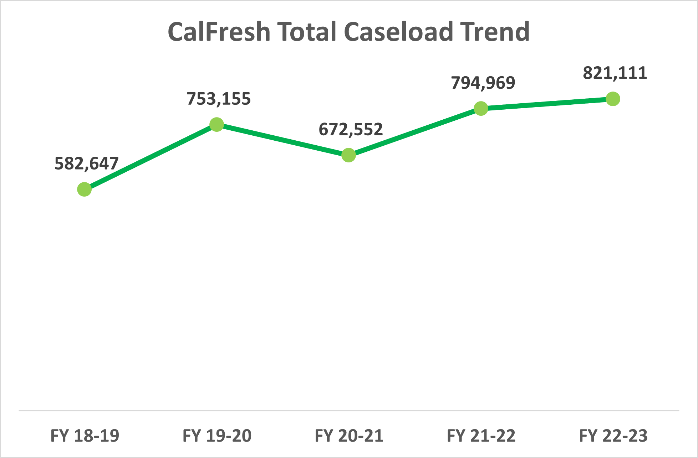

# CalFresh Program Analysis
## Overview of CalFresh Program
CalFresh is a state-managed program in California (known nationwide as the Supplemental Nutrition Assistance Program or SNAP or food stamps) that provides low-income individuals and families with funds on an Electronic Benefit Transfer (EBT) card. These funds can be used to purchase food at authorized retail stores, grocery stores, and farmer's markets.The program aims to help eligible households afford nutritious food and improve their overall health and well-being. CalFresh is administered by the California Department of Social Services (CDSS) and is funded by the federal government. Eligibility is determined based on income and certain expenses. The program not only addresses immediate food needs but also strives to alleviate poverty and promote better nutrition among low-income individuals and families across California.


## Participate to the CalFresh Program
- Who: provide low-income household, indivuduals, and families with funds to afford nutritious food.
- How: Provide information about your income, expenses, housing costs, and personal information for all members of your household to qualify CalFresh. 
- Where: The application process can vary by county, apply online, in person at your local county social services office, or by mail.

## Results

### Participants
#### Demographics
- CalFresh CaseLoad: Child-Only Households, Person in Child-Only Household, English as Second Language(ESL) Childer Under Age 18, Elderly (60+).
- County/State General Population: Total Population, Elderly Population (60+), Population Under Age 18, ESL Population (>=Age 5), SSI Recipients (State Data Exchange), Unemployment Rate, Persons Receiving Medi-Cal.


#### Annual Population in CA
- ``` Top 10 Counties has the most population in California ```
  
    


#### Processing Time& Accuracy
### Trends
Based on CF 296 FY18-23 CalFresh Monthly Caseload Movement Statistical Report, analyze the Sacramento county monthly Caseload status.
  
  - CalFresh Caseload from 2018 to 2023 fiscal year.

    
    
 - CalFresh Caseload based on total pure state cases from last year.

    

 - CalFresh approved application vs. denied appliation of total caseload.

    
    
  - Sacramento Annual CalFresh Stats by Age

   


  - Sacramento Total percentage SSI Recipients
    

       
## Summary
  - CalFresh Application process types: there're 70% of the total caseload for applications are submitted online.
Around 70% of the total caseload for CalFresh applications are submitted online.
Over the past 5 fiscal years, there has been a consistent upward trend in the CalFresh caseload.
CalFresh maintains an average caseload of 725,000 each fiscal year, with an average approval rate of 62% and a denial rate of 34%.
Based on data from the previous year, there is a noticeable and steady increase in the total number of state cases.


## Resources
- Apply CalFresh online: https://www.getcalfresh.org
- CalFresh Official Website: https://www.cdss.ca.gov/calfresh
- Contact Local Office: https://www.cdss.ca.gov/county-offices
- CDSS organization chart: chrome-extension://efaidnbmnnnibpcajpcglclefindmkaj/https://www.cdss.ca.gov/Portals/13/CDSSOrgChart.pdf

